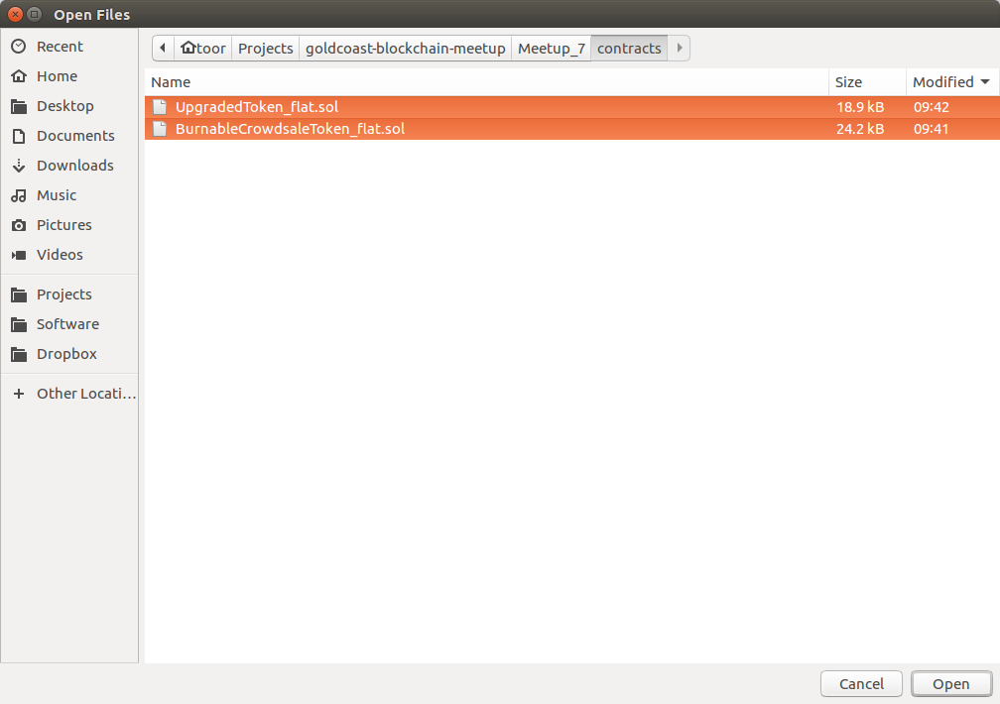
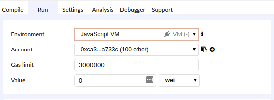
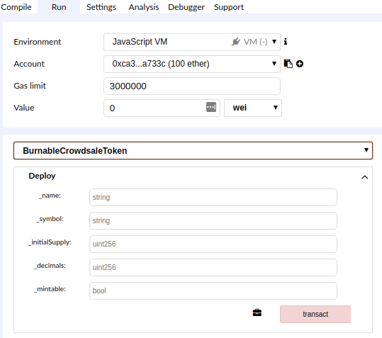
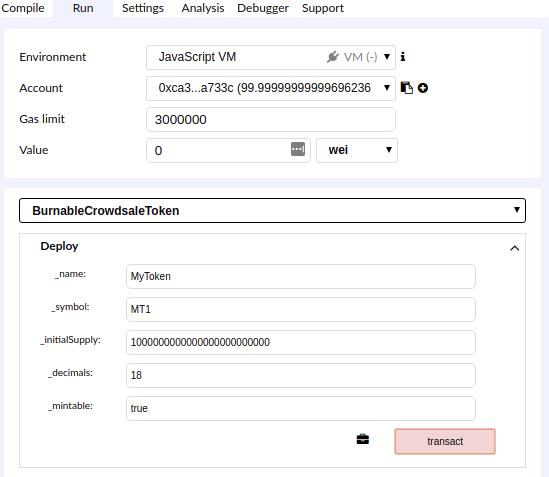
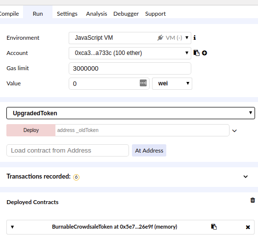
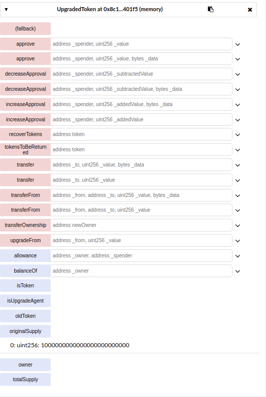
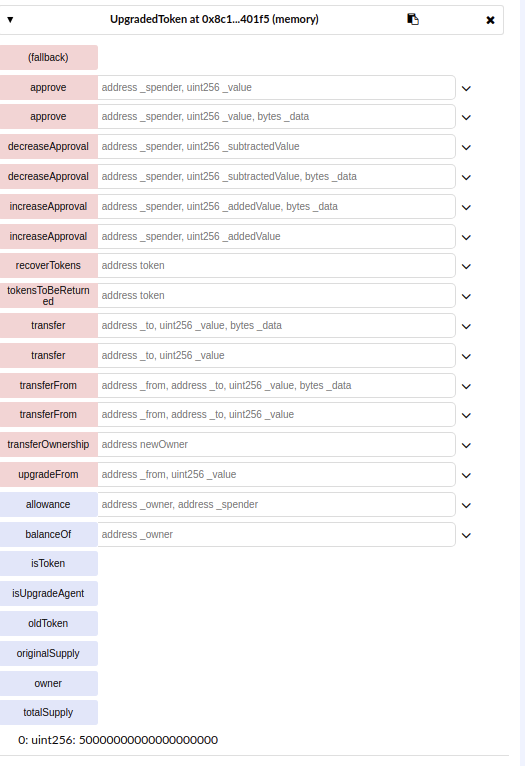

# Introduction

Every so often there are issues in code that requires fixing and while fixing code in traditional environments is straight forward , how does one fix code on an immutable non reversible ledger such as the blockchain ? 

In this session we look at how a token contract can be upgraded on ethereum, also while exploring this feature we will look into some of the other features of advance token contracts such as transfer locking and releasing.

So let's get started


1. Clone the following repo and change directory to Meetup_7

```
git clone https://github.com/dpnova/goldcoast-blockchain-meetup.git
```

2. Logon to https://remix.ethereum.org in your browser

3. Open the Contracts from the Meetup_7/contracts directory

NOTE : The contract's have been obtained from https://github.com/TokenMarketNet/ico and flattened for ease of use using https://github.com/BlockCatIO/solidity-flattener . Contract UpgradedToken_flat.sol is a copy of TestMigrationAgent.sol with modifications to the contract name.



4. Click on the Contract BurnableCrowdsaleToken_flat.sol

5. Click on the run tab and for Environment select Javascript VM. You can also choose Injected Web3 if you would like to use Metamask or web3 provider if you would like to interact with a custom chain such as a local geth or ganache node.



6. From Dropdown select BurnableCrowdsaleToken and expand the Deploy section by clickin the down arrow.



7. Enter the following parameters and click Transact

_name : MyToken 
_symbol : MT1
_initialSupply : 1000000000000000000000000    NOTE : That is 24 X 0's , which makes it 1 Million tokens followed by 18 decimal places.
_decimals : 18
_mintable : true



8. Your Token contract will be deployed and available for interaction under Deployed Contracts. Expand it and click on Can Upgrade , it should return false.  Next click on getUpgradeState it should return 1 


NOTE :  When tokens are initially created often token issuers might choose to lock the transfer of tokens untill a certain event such as Exchange Listing or product go live before allowing tokens to be transferred. So before we can do the below steps, we need to ensure tokens are transferrable. 

9. Copy the Token contract publisher account address by clickin the copy button next to account.

10.  Paste the address in SetReleaseAgent and click on SetReleaseAgent.


11. Click on releaseTokenTransfer. This will remove the Transfer locking on the tokens and now holders of the token can transfer the token's between each other.


12. Now click on getUpgradeState and it should return 2.

13. Next we will publish the contract to which we want to upgrade the existing tokens to.

14. Click on UpgradedToken_flat.sol and click on the compile tabe and click Start to Compile.


15. Click on Run tab and  from the dropdown select UpgradedToken



16. Copy the address of the previously published token. This needs to be provided as an input to our UpgradedToken contract so it can determine the total supply of the existing tokens in the contract to be upgraded.

17. Paste it in the filed address_oldToken and click Deploy

18. Expand the newly published UpgradedToken contract and click on OriginalSupply. This should match the TotalSupply of the previously published Token Contract.



19. Copy the Address of the UpgradedToken contract and paste it in setUpgradeAgent function field for the BurnableCrowdsaleToken and click on setUpgradeAgent.

NOTE : In case your contract functions cease to respond , this is a remix GUI bug. Note the contract address and reload it for interaction by specifying it as follows.


20. Clickin on canUpgrade should now return true and getUpgradeState should return 3. Token holders can call the upgrade function now to Upgrade Tokens.


21. Enter the number of tokens you wish to upgrade and click on Upgrade. For example enter 50000000000000000000 as per below.


22. Click totalSupply for BurnableCrowdsaleToken it should show that the total number of tokens in supply for BurnableCrowdsaleToken has decreased by 50000000000000000000


23. Click totalSupply for UpgradedToken and it will show 50000000000000000000 tokens in supply. The old tokens have been destroyed and an equvivalent number of new tokens have been issued.




